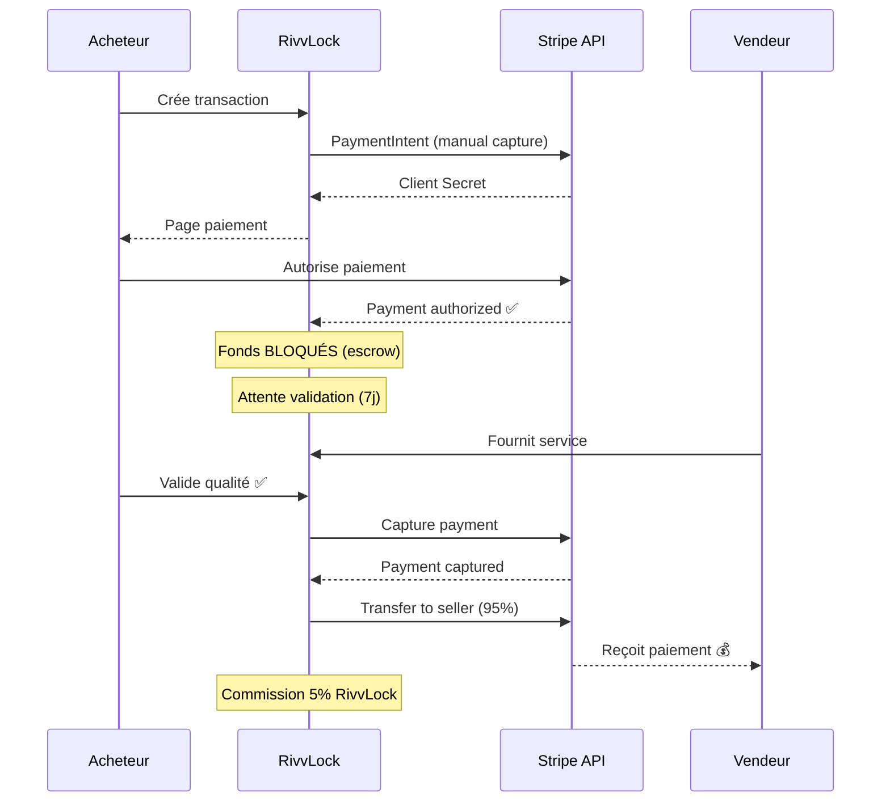
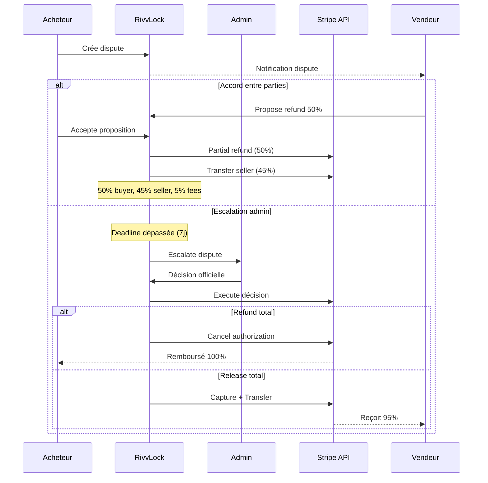

# 🏗️ Architecture RivvLock

## Vue d'ensemble

RivvLock est une plateforme d'**escrow** (séquestre) qui sécurise les transactions entre acheteurs et vendeurs.

```
┌─────────────┐         ┌──────────────┐         ┌─────────────┐
│   Acheteur  │ ─────▶ │  RivvLock    │ ◀────── │   Vendeur   │
│   (Buyer)   │         │  (Escrow)    │         │   (Seller)  │
└─────────────┘         └──────────────┘         └─────────────┘
       │                        │                        │
       │ 1. Paiement            │ 2. Sécurise fonds      │
       │    (Stripe Auth)       │    (Manual Capture)    │
       │                        │                        │
       │ 3. Valide qualité      │ 4. Libère fonds        │
       └────────────────────────┴────────────────────────┘
```

---

## Stack Technique

### Frontend
- **React 18** + TypeScript
- **Tailwind CSS** + shadcn/ui
- **React Query** (TanStack Query) pour state management
- **React Router** pour navigation
- **i18next** pour internationalisation (FR/EN/DE)
- **Vite** pour build/dev

### Backend
- **Supabase** (PostgreSQL + Auth + Edge Functions)
- **Stripe** pour paiements (manual capture)
- **Edge Functions** (Deno) pour logique métier

### Sécurité
- **RLS (Row Level Security)** sur toutes les tables
- **Security Definer Functions** pour queries complexes
- **Audit Logging** automatique
- **Rate Limiting** sur API calls

---

## Architecture de paiement (Escrow)

### Flow nominal sans dispute



### Flow avec dispute



---

## Structure des données

### Tables principales

```
┌──────────────────┐
│   transactions   │ ◀── Table centrale
├──────────────────┤
│ user_id (seller) │
│ buyer_id         │
│ price, currency  │
│ status           │
│ payment_intent   │
│ service_date     │
└──────────────────┘
         │
         ├─── Has Many ───▶ ┌─────────────────┐
         │                  │ transaction_msg │
         │                  └─────────────────┘
         │
         ├─── Has Many ───▶ ┌─────────────────┐
         │                  │   disputes      │
         │                  └─────────────────┘
         │                           │
         │                           ├─── Has Many ───▶ ┌──────────────────┐
         │                           │                  │ dispute_messages │
         │                           │                  └──────────────────┘
         │                           │
         │                           └─── Has Many ───▶ ┌──────────────────┐
         │                                              │dispute_proposals │
         │                                              └──────────────────┘
         │
         └─── Has One ────▶ ┌─────────────────┐
                            │    invoices     │
                            └─────────────────┘
```

### Statuts de transaction

```typescript
type TransactionStatus = 
  | 'pending'       // Attente paiement acheteur
  | 'payment_blocked' // Paiement échoué/bloqué
  | 'expired'       // Délai paiement dépassé
  | 'paid'          // Payé, en attente validation
  | 'validated'     // Validé par acheteur
  | 'completed'     // Fonds transférés au vendeur
  | 'disputed'      // En litige
  | 'cancelled';    // Annulé
```

### Statuts de dispute

```typescript
type DisputeStatus =
  | 'open'              // Créé, attente réponse
  | 'responded'         // Vendeur a répondu
  | 'negotiating'       // Propositions en cours
  | 'escalated'         // Transmis à l'admin
  | 'resolved'          // Résolu (accord)
  | 'resolved_refund'   // Résolu (remboursement)
  | 'resolved_release'; // Résolu (libération fonds)
```

---

## Edge Functions Architecture

### Functions par catégorie

#### 💳 Paiement (6 functions)
```
create-payment-intent      → Authorize payment (manual capture)
mark-payment-authorized    → Update status après paiement
process-automatic-transfer → Transfer automatique après validation
release-funds              → Liberation fonds manuelle
create-payment-checkout    → Checkout Stripe (non utilisé actuellement)
sync-stripe-payments       → Sync paiements Stripe
```

#### 🔄 Transactions (8 functions)
```
create-transaction         → Créer transaction
join-transaction           → Acheteur rejoint via lien
get-transaction-by-token   → Récupérer par token partagé
delete-expired-transaction → Cleanup transactions expirées
renew-expired-transaction  → Renouveler transaction expirée
request-date-change        → Demander changement date
respond-to-date-change     → Répondre changement date
process-validation-deadline→ Traiter deadline validation
```

#### ⚖️ Disputes (10 functions)
```
create-dispute             → Créer litige
respond-to-dispute         → Répondre à litige
create-proposal            → Créer proposition
accept-proposal            → Accepter proposition
reject-proposal            → Rejeter proposition
create-admin-proposal      → Proposition officielle admin
validate-admin-proposal    → Valider proposition admin
process-dispute            → Résoudre dispute (admin)
admin-dispute-actions      → Actions admin sur disputes
process-dispute-deadlines  → Traiter deadlines disputes
```

#### 📄 Facturation (3 functions)
```
generate-invoice-number    → Génère numéro facture sécurisé
get-invoice-data           → Récupère données facture
generate-annual-report     → Rapport annuel CSV
```

#### 👤 Utilisateurs (8 functions)
```
delete-user-account        → Suppression compte RGPD
export-user-data           → Export données RGPD
clean-old-users            → Cleanup comptes non vérifiés
get-user-emails            → Récupération emails (admin)
sync-stripe-customers      → Sync clients Stripe
create-stripe-customer     → Créer client Stripe
gdpr-data-retention-cleanup→ Cleanup RGPD automatique
send-notifications         → Envoi notifications
```

#### 🔐 Stripe Connect (5 functions)
```
create-stripe-account      → Créer compte vendeur
update-stripe-account-info → Update info compte
check-stripe-account-status→ Vérifier statut compte
validate-stripe-accounts   → Valider comptes (admin)
refresh-counterparty-stripe-status → Refresh statut contrepartie
```

#### 🔧 Maintenance (4 functions)
```
fix-blocked-transaction    → Fix transactions bloquées
fix-reactivated-transactions→ Fix transactions réactivées
fix-resolved-disputes      → Fix disputes résolus
process-expired-payment-deadlines → Process deadlines paiement
```

**Total : 45 edge functions**

---

## Sécurité

### Défense en profondeur (Defense in Depth)

```
┌───────────────────────────────────────┐
│  1. Frontend Validation (UX)          │ ← Zod schemas
├───────────────────────────────────────┤
│  2. Edge Function Validation          │ ← Rate limiting
├───────────────────────────────────────┤
│  3. RLS Policies (Database)           │ ← auth.uid() checks
├───────────────────────────────────────┤
│  4. Security Definer Functions        │ ← Business rules
├───────────────────────────────────────┤
│  5. Audit Logging                     │ ← Activity tracking
└───────────────────────────────────────┘
```

### Principes appliqués

1. **Principle of Least Privilege**
   - Chaque utilisateur voit UNIQUEMENT ses données
   - Admins ont accès limité avec audit logging
   - Super admins pour opérations sensibles

2. **Input Validation**
   - Prix : 1€ - 1M€
   - Messages : 1000 caractères max
   - Disputes : 100 messages max
   - SIRET/VAT/AVS avec validation algorithmique

3. **Token Security**
   - Tokens 256-bit (32 bytes random)
   - Expiration 24h par défaut
   - Rate limiting sur accès

4. **Audit Trail**
   - `activity_logs` : actions utilisateurs
   - `profile_access_logs` : accès données sensibles
   - `security_audit_log` : événements sécurité
   - `admin_role_audit_log` : changements rôles admin

---

## Performance

### Optimisations actuelles

- ✅ **React Query caching** : 5 min stale time
- ✅ **Virtual scrolling** : Listes longues
- ✅ **Lazy loading** : Routes code-split
- ✅ **Debouncing** : Recherche/filtres
- ⚠️ **Pagination** : À implémenter

### Bottlenecks identifiés

1. **Queries non paginées**
   ```typescript
   // Problème : charge toutes les transactions
   .select('*')
   
   // Solution future : pagination
   .select('*')
   .range(0, 49) // 50 par page
   ```

2. **Realtime channels multiples**
   - Chaque transaction = 1 channel
   - 100 transactions = 100 channels ouverts
   - Solution : debounce invalidations

3. **N+1 queries potentielles**
   - Fetch transaction → puis dispute → puis messages
   - Solution : optimiser avec joins

---

## Gestion des erreurs

### Stratégie actuelle

```typescript
// Pattern utilisé partout
try {
  await operation();
  toast.success("✅ Succès");
} catch (error) {
  logger.error("❌ Error:", error);
  toast.error("Une erreur est survenue");
}
```

### À améliorer

1. **Messages contextuels**
   ```typescript
   catch (error) {
     if (error.message.includes('not found')) {
       toast.error("Transaction introuvable");
     } else if (error.message.includes('unauthorized')) {
       toast.error("Accès non autorisé");
     } else {
       toast.error("Erreur : " + error.message);
     }
   }
   ```

2. **Retry logic pour erreurs réseau**
   ```typescript
   // React Query retry par défaut : 3 fois
   // À configurer per-query pour operations critiques
   ```

3. **Error boundaries granulaires**
   ```typescript
   // Actuellement : GlobalErrorBoundary + LocalErrorBoundary
   // À ajouter : Error boundaries par section (paiement, disputes, etc.)
   ```

---

## Déploiement

### Environnements

1. **Development** (localhost:8080)
   - Hot reload activé
   - Logs verbeux
   - Mock payments (Stripe test mode)

2. **Preview** (lovable.app)
   - Build optimisé
   - Supabase staging
   - Stripe test mode

3. **Production** (custom domain)
   - Build prod optimisé
   - Supabase prod
   - Stripe live mode
   - Monitoring Sentry actif

### Variables d'environnement

```bash
# Supabase
SUPABASE_URL=https://slthyxqruhfuyfmextwr.supabase.co
SUPABASE_ANON_KEY=[key]
SUPABASE_SERVICE_ROLE_KEY=[secret] # Seulement côté serveur

# Stripe
STRIPE_SECRET_KEY=[secret] # Edge functions only
VITE_STRIPE_PUBLISHABLE_KEY=[public] # Frontend

# Monitoring (optionnel)
VITE_SENTRY_DSN=[secret] # Frontend error tracking
```

---

## Patterns & Best Practices

### 1. Hooks personnalisés

```typescript
// Pattern : un hook = une responsabilité
useTransactions()      → Fetch + cache transactions
useDisputeMessages()   → Messaging disputes
useStripeAccount()     → Statut compte Stripe
```

### 2. Edge Functions

```typescript
// Pattern : validation → business logic → response
serve(async (req) => {
  // 1. CORS
  if (req.method === "OPTIONS") return cors;
  
  // 2. Auth
  const user = await authenticate(req);
  
  // 3. Authorization
  if (!isAuthorized(user)) throw Error("Unauthorized");
  
  // 4. Validation
  const validated = validate(schema, await req.json());
  
  // 5. Business Logic
  const result = await executeBusinessLogic(validated);
  
  // 6. Response
  return Response.json({ success: true, data: result });
});
```

### 3. RLS Policies

```sql
-- Pattern : politique restrictive par défaut
CREATE POLICY "policy_name" ON table_name
FOR SELECT 
USING (
  auth.uid() = user_id OR  -- Own data
  is_admin(auth.uid())      -- Admin access
);
```

---

## Décisions d'architecture (ADR)

### ADR-001 : Manual Capture Stripe

**Problème :** Protéger acheteur ET vendeur dans transactions
**Solution :** `capture_method: 'manual'` sur PaymentIntent
**Avantages :**
- Fonds bloqués jusqu'à validation
- Annulation possible sans frais si problème
- Protection buyer & seller

**Inconvénients :**
- Plus complexe que capture automatique
- Délai 7 jours avant expiration authorization

### ADR-002 : Separate Charges + Transfers (pas Application Fee)

**Problème :** Flexibilité sur distribution fonds (refunds partiels)
**Solution :** Capture 100% puis Transfer net au vendeur
**Avantages :**
- Contrôle total sur montants
- Support partial refunds complexes
- Traçabilité complète

**Inconvénients :**
- Gestion manuelle des fees
- Plus de calls API Stripe

### ADR-003 : Admin Notes dans table séparée

**Problème :** Sécurité notes admin confidentielles
**Solution :** Table `admin_dispute_notes` dédiée avec RLS super strict
**Avantages :**
- Isolation totale des notes sensibles
- Audit trail complet
- Contrôle d'accès granulaire (super_admin only)

**Inconvénients :**
- Join supplémentaire pour fetch notes

### ADR-004 : Message limits (disputes + transactions)

**Problème :** Prévenir spam et abuse
**Solution :** 100 messages max par dispute, validation côté serveur
**Avantages :**
- Protection DB overload
- Prévention abuse
- Coûts maitrisés

**Inconvénients :**
- Limite arbitraire (mais raisonnable)

---

## Tests

Voir [README_TESTS.md](./README_TESTS.md) pour la documentation complète des tests.

**Coverage actuel :**
- Utilities: 85%+
- Hooks: 60%+
- Components: 40% (à améliorer)
- Edge Functions: Partiellement testé

---

## Monitoring

### Logs disponibles

1. **Edge Function Logs** (Supabase)
   - Accessible via Supabase Dashboard
   - Retention: 7 jours
   - Format: JSON structuré

2. **Database Logs** (PostgreSQL)
   - Queries lentes (>100ms)
   - Erreurs RLS
   - Retention: 7 jours

3. **Application Logs** (Sentry - si configuré)
   - Erreurs frontend
   - Performance metrics
   - Session replays

### Métriques business

```typescript
// À tracker pour analytics
- Transactions créées / jour
- Taux de conversion (pending → paid)
- Taux de disputes (< 5% souhaitable)
- Temps moyen résolution dispute
- Volume paiements par devise
```

---

## Roadmap technique

### Court terme (1-2 mois)
- [ ] Tests E2E (Playwright)
- [ ] Pagination queries
- [ ] Error handling amélioré
- [ ] Webhooks Stripe

### Moyen terme (3-6 mois)
- [ ] Cache layer (Redis optionnel)
- [ ] Analytics avancé
- [ ] A/B testing
- [ ] Notifications push

### Long terme (6+ mois)
- [ ] Mobile app (React Native)
- [ ] Multi-tenancy
- [ ] White-label solution
- [ ] API publique

---

**Dernière mise à jour :** 14 Octobre 2025
