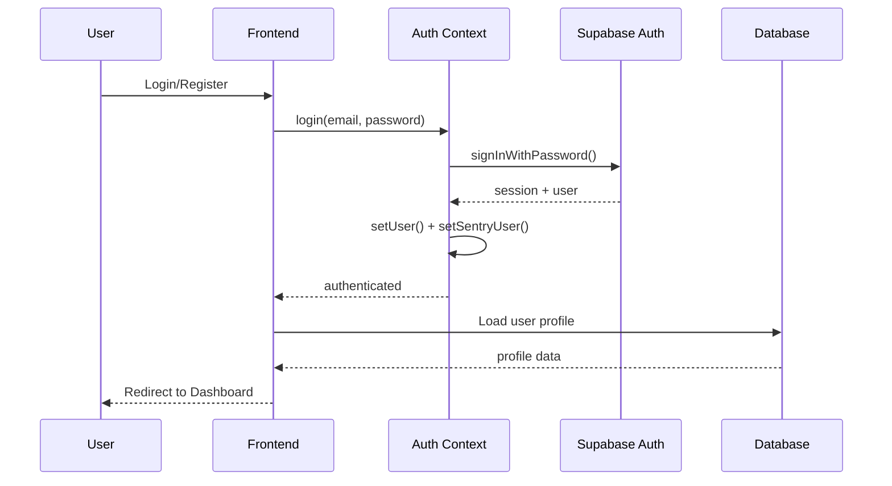
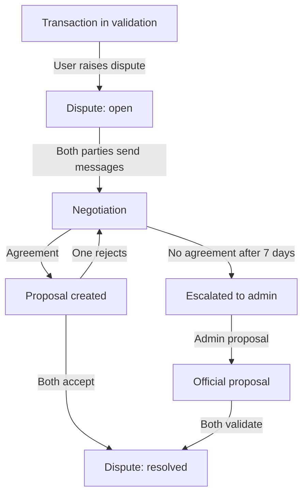

# 👨‍💻 Developer Guide - RivvLock

## 📋 Quick Start for New Developers

### Prerequisites
```bash
Node.js >= 18
npm or bun
Supabase CLI (optional, for local development)
```

### Setup
```bash
# Clone the repository
git clone [your-repo-url]
cd rivvlock

# Install dependencies
npm install

# Configure environment
cp .env.example .env
# Edit .env with your Supabase credentials

# Start development server
npm run dev
```

## 🏗️ Architecture Overview

### Tech Stack
- **Frontend**: React 18 + TypeScript + Vite
- **Styling**: Tailwind CSS + shadcn/ui
- **State Management**: TanStack Query (React Query)
- **Backend**: Supabase (PostgreSQL + Edge Functions)
- **Payments**: Stripe Connect (escrow system)
- **i18n**: react-i18next (FR, EN, DE)
- **Monitoring**: Sentry (error tracking)
- **Testing**: Vitest + React Testing Library

### Project Structure
```
rivvlock/
├── src/
│   ├── components/          # React components
│   │   ├── ui/             # shadcn/ui base components
│   │   ├── *Card.tsx       # Feature-specific cards
│   │   └── *Dialog.tsx     # Modal dialogs
│   ├── hooks/              # Custom React hooks
│   ├── lib/                # Utilities and helpers
│   │   ├── __tests__/      # Unit tests
│   │   ├── logger.ts       # Production-safe logging
│   │   ├── sentry.ts       # Error tracking
│   │   └── validations.ts  # Zod schemas
│   ├── pages/              # Route pages
│   ├── contexts/           # React contexts (Auth)
│   ├── i18n/               # Translations
│   └── integrations/       # Supabase client
├── supabase/
│   ├── functions/          # Edge Functions (backend)
│   │   ├── _shared/        # Shared utilities
│   │   └── [function-name]/
│   └── migrations/         # Database migrations (read-only)
└── public/                 # Static assets
```

## 🔐 Authentication Flow



### Key Files
- `src/contexts/AuthContext.tsx` - Auth state management + Sentry integration
- `src/components/ProtectedRoute.tsx` - Route protection
- `src/components/AdminRoute.tsx` - Admin-only routes
- `src/hooks/useIsAdmin.ts` - Admin status check

## 💳 Payment Flow (Stripe Escrow)

### Architecture
RivvLock uses Stripe Connect's **separate charges and transfers** model:
1. Buyer pays → funds held on platform Stripe account
2. Manual capture after validation period
3. Automatic transfer to seller's connected account
4. Application fee deducted

### Key Components

#### Frontend
- `src/components/NewTransactionDialog.tsx` - Create transaction
- `src/components/CompleteTransactionButton.tsx` - Finalize payment
- `src/components/TransactionCard.tsx` - Transaction display
- `src/hooks/useTransactions.ts` - Transaction data management

#### Backend (Edge Functions)
- `create-payment-intent` - Initialize payment (on_behalf_of seller)
- `mark-payment-authorized` - Capture held funds
- `process-automatic-transfer` - Transfer to seller
- `release-funds` - Manual release (admin)
- `create-payment-checkout` - Checkout session for buyer

### Payment States
```
pending → awaiting_payment → payment_authorized → 
validation_period → completed
                ↓
              expired (if payment not made)
              disputed (if dispute raised)
```

## 🔥 Dispute System

### Flow


### Key Files
- `src/components/DisputeCard/` - Dispute display components
- `src/hooks/useDisputes.ts` - Dispute management
- `src/hooks/useDisputeMessages.ts` - Messaging (100 msg limit)
- `supabase/functions/create-dispute/` - Create dispute
- `supabase/functions/respond-to-dispute/` - Negotiate
- `supabase/functions/process-dispute-deadlines/` - Auto-escalation

### Admin Powers
- View all disputes (`admin_disputes` table)
- Create official proposals
- Force resolution
- Manual fund release

## 🎨 Design System

### Semantic Tokens (index.css)
```css
/* ALWAYS use these instead of direct colors */
--primary: [HSL]        /* Main brand color */
--secondary: [HSL]      /* Secondary actions */
--accent: [HSL]         /* Highlights */
--destructive: [HSL]    /* Danger/errors */
--muted: [HSL]          /* Disabled/subtle */
--background: [HSL]     /* Page background */
--foreground: [HSL]     /* Main text */
```

### Component Variants
All shadcn components support variants defined in their respective files:
```tsx
// ✅ CORRECT: Use variants
<Button variant="destructive">Delete</Button>
<Badge variant="outline">Status</Badge>

// ❌ WRONG: Don't use direct colors
<Button className="bg-red-500">Delete</Button>
```

## 🪝 Custom Hooks Pattern

### Data Fetching Hooks
```typescript
// Pattern: useFeature.ts
export const useTransactions = () => {
  const { user } = useAuth();
  
  return useQuery({
    queryKey: ['transactions', user?.id],
    queryFn: async () => {
      // Fetch data
      const { data, error } = await supabase
        .from('transactions')
        .select('*')
        .or(`seller_id.eq.${user!.id},buyer_id.eq.${user!.id}`)
        .order('created_at', { ascending: false });
      
      if (error) throw error;
      return data;
    },
    enabled: !!user?.id,
  });
};
```

### Mutation Hooks
```typescript
// Pattern: useFeatureAction.ts
export const useCreateDispute = () => {
  const queryClient = useQueryClient();
  
  return useMutation({
    mutationFn: async (params: CreateDisputeParams) => {
      const { data, error } = await supabase.functions.invoke(
        'create-dispute',
        { body: params }
      );
      if (error) throw error;
      return data;
    },
    onSuccess: () => {
      // Invalidate related queries
      queryClient.invalidateQueries({ queryKey: ['disputes'] });
      toast.success('Dispute created');
    },
  });
};
```

## 🔧 Edge Functions Guidelines

### Standard Structure
```typescript
import { serve } from "https://deno.land/std@0.190.0/http/server.ts";
import { createClient } from "https://esm.sh/@supabase/supabase-js@2.57.2";

// ALWAYS include CORS
const corsHeaders = {
  'Access-Control-Allow-Origin': '*',
  'Access-Control-Allow-Headers': 'authorization, x-client-info, apikey, content-type',
};

serve(async (req) => {
  // Handle CORS preflight
  if (req.method === 'OPTIONS') {
    return new Response(null, { headers: corsHeaders });
  }

  try {
    // Auth (use service_role for admin operations)
    const supabaseClient = createClient(
      Deno.env.get('SUPABASE_URL') ?? '',
      Deno.env.get('SUPABASE_SERVICE_ROLE_KEY') ?? '',
      { auth: { persistSession: false } }
    );

    // Get user from token
    const authHeader = req.headers.get('Authorization')!;
    const token = authHeader.replace('Bearer ', '');
    const { data: { user } } = await supabaseClient.auth.getUser(token);
    if (!user) throw new Error('Unauthorized');

    // Parse request
    const body = await req.json();

    // Business logic here
    
    // Return success
    return new Response(JSON.stringify({ success: true }), {
      headers: { ...corsHeaders, 'Content-Type': 'application/json' },
      status: 200,
    });
  } catch (error) {
    console.error('Error:', error);
    return new Response(JSON.stringify({ error: error.message }), {
      headers: { ...corsHeaders, 'Content-Type': 'application/json' },
      status: 500,
    });
  }
});
```

### Best Practices
1. **NEVER use raw SQL** - Use Supabase client methods only
2. **ALWAYS validate inputs** - Use Zod schemas
3. **Rate limiting** - Use `_shared/rate-limiter.ts`
4. **Logging** - Use `_shared/logger.ts` (production-safe)
5. **Idempotency** - Check for duplicate operations
6. **Atomic operations** - Use transactions when needed

## 🧪 Testing

### Running Tests
```bash
npm run test           # Run all tests
npm run test:ui        # Interactive UI
npm run test:coverage  # Coverage report
```

### Writing Tests
```typescript
import { describe, it, expect, vi } from 'vitest';
import { render, screen } from '@/test/utils/test-utils';

describe('MyComponent', () => {
  it('should render correctly', () => {
    render(<MyComponent />);
    expect(screen.getByText('Hello')).toBeInTheDocument();
  });
});
```

### Test Coverage Goals
- **Utils**: 90%+ (validations, constants)
- **Hooks**: 70%+ (data fetching, mutations)
- **Components**: 60%+ (UI components)
- **Edge Functions**: Manual testing (Supabase environment)

## 🚨 Error Handling

### Frontend
```typescript
// Use LocalErrorBoundary for component isolation
<LocalErrorBoundary fallback={<ErrorMessage />}>
  <CriticalComponent />
</LocalErrorBoundary>

// Manual error capture
import { captureException } from '@/lib/sentry';

try {
  await riskyOperation();
} catch (error) {
  captureException(error, {
    tags: { context: 'payment' },
    extra: { transactionId }
  });
  toast.error('Operation failed');
}
```

### Backend
```typescript
// Edge functions auto-log errors
try {
  // Operation
} catch (error) {
  console.error('[function-name] Error:', error);
  return new Response(
    JSON.stringify({ error: error.message }),
    { status: 500 }
  );
}
```

## 🔒 Security Checklist

### Frontend
- ✅ All forms use Zod validation
- ✅ No sensitive data in console.log (production)
- ✅ HTTPS only in production
- ✅ No raw HTML rendering
- ✅ CSP headers configured

### Backend
- ✅ RLS enabled on all tables
- ✅ No raw SQL queries
- ✅ Rate limiting on public endpoints
- ✅ Input validation with Zod
- ✅ CORS properly configured
- ✅ Service role key only for admin ops

### Database (RLS Policies)
```sql
-- Example: Users can only see their own transactions
CREATE POLICY "Users see own transactions"
ON transactions FOR SELECT
USING (
  auth.uid() = seller_id OR 
  auth.uid() = buyer_id
);
```

## 📦 Deployment

### Production Checklist
1. ✅ All tests passing (`npm run test`)
2. ✅ TypeScript compiles (`npm run build`)
3. ✅ Sentry DSN configured
4. ✅ Stripe keys (live mode)
5. ✅ Supabase env vars set
6. ✅ Rate limits configured
7. ✅ Database backups enabled

### Monitoring
- **Sentry**: Error tracking + performance
- **Supabase**: Database logs + edge function logs
- **Stripe Dashboard**: Payment monitoring

## 🐛 Common Issues & Solutions

### Issue: "Transaction not found"
**Cause**: RLS policy blocking access  
**Fix**: Check user owns the transaction (seller_id or buyer_id)

### Issue: "Stripe: No such charge"
**Cause**: Using test/live mode mismatch  
**Fix**: Verify `STRIPE_SECRET_KEY` matches environment

### Issue: "Payment intent cannot be captured"
**Cause**: Payment not authorized yet  
**Fix**: Check `payment_intent_status = 'requires_capture'`

### Issue: "CORS error on edge function"
**Cause**: Missing CORS headers or OPTIONS handler  
**Fix**: Add `corsHeaders` and handle OPTIONS request

## 📚 Key Documentation

- [ARCHITECTURE.md](./ARCHITECTURE.md) - System architecture
- [MONITORING.md](./MONITORING.md) - Sentry setup & observability
- [README_TESTS.md](./README_TESTS.md) - Testing guide
- [SECURITY_AUDIT_REPORT_FINAL.md](./SECURITY_AUDIT_REPORT_FINAL.md) - Security review

## 🔗 External Resources

- [Supabase Docs](https://supabase.com/docs)
- [Stripe Connect](https://stripe.com/docs/connect)
- [React Query](https://tanstack.com/query/latest)
- [Tailwind CSS](https://tailwindcss.com)
- [shadcn/ui](https://ui.shadcn.com)
- [Sentry React](https://docs.sentry.io/platforms/javascript/guides/react/)

## 💡 Pro Tips

1. **Use TanStack Query DevTools** in development to debug queries
2. **Check Supabase logs** for edge function errors
3. **Use Stripe test mode** cards: `4242 4242 4242 4242`
4. **Enable Sentry Session Replay** to see exactly what users experienced
5. **Run `npm run test:coverage`** before opening PRs

---

**Questions?** Check existing code examples or ask the team on Discord.

**Last updated:** October 13, 2025
