# 🗄️ Schéma Base de Données - Tables Sensibles Protégées

**Date:** 15 octobre 2025  
**Version:** 1.0  
**Responsable:** Bruno Dias - contact@rivvlock.com

---

## 📊 Vue d'Ensemble

**19 tables sensibles** protégées par Row Level Security (RLS)  
**45 RLS Policies** actives  
**8 SECURITY DEFINER Functions** pour isolation sécurisée

---

## 🎨 Diagramme Entity-Relationship (ERD)

```mermaid
erDiagram
    %% Données Utilisateur
    profiles ||--o{ transactions : "user_id (seller)"
    profiles ||--o{ transactions : "buyer_id"
    profiles ||--o{ stripe_accounts : "user_id"
    profiles ||--o{ stripe_customers : "user_id"
    profiles ||--o{ activity_logs : "user_id"
    profiles ||--o{ annual_reports : "user_id"
    profiles ||--o{ notifications : "user_id"

    %% Transactions
    transactions ||--o{ invoices : "transaction_id"
    transactions ||--o{ transaction_messages : "transaction_id"
    transactions ||--o{ disputes : "transaction_id"
    transactions ||--o{ date_change_requests : "transaction_id"

    %% Litiges (Disputes)
    disputes ||--o{ dispute_messages : "dispute_id"
    disputes ||--o{ dispute_proposals : "dispute_id"
    disputes ||--o{ admin_official_proposals : "dispute_id"
    
    %% Messages
    transaction_messages ||--o{ transaction_message_reads : "message_id"
    dispute_messages ||--o{ dispute_message_reads : "message_id"

    %% Proposals Admin
    admin_official_proposals ||--o{ admin_official_proposal_validations : "proposal_id"

    %% Audit & Sécurité
    profiles ||--o{ profile_access_logs : "accessed_profile_id"
    profiles ||--o{ security_audit_log : "user_id (indirect)"

    %% Définitions des Tables
    profiles {
        uuid user_id PK "🔒 RLS: auth.uid() = user_id OR is_admin() OR counterparty"
        text first_name
        text last_name
        text email
        user_type user_type "individual | company"
        country_code country
        boolean verified
        text company_name
        text siret_uid "FR"
        text avs_number "CH"
        text vat_number
        boolean registration_complete
    }

    transactions {
        uuid id PK "🔒 RLS: user_id = auth.uid() OR buyer_id = auth.uid() OR is_admin()"
        uuid user_id FK "Seller"
        uuid buyer_id FK
        numeric amount
        text currency
        transaction_status status
        text stripe_payment_intent_id "🔒 Masqué pour non-admin"
        timestamp payment_received_at
        timestamp validation_deadline
        text shared_link_token "🔒 32+ chars cryptographiques"
        timestamp shared_link_expires_at
    }

    stripe_accounts {
        uuid id PK "🔒 RLS: user_id = auth.uid() OR is_admin()"
        uuid user_id FK
        text stripe_account_id "🔒 Sensible"
        boolean charges_enabled
        boolean payouts_enabled
        boolean onboarding_completed
        account_status account_status
    }

    stripe_customers {
        uuid id PK "🔒 RLS: user_id = auth.uid() OR is_admin()"
        uuid user_id FK
        text stripe_customer_id "🔒 Sensible"
    }

    invoices {
        uuid id PK "🔒 RLS: seller_id = auth.uid() OR buyer_id = auth.uid() OR is_admin()"
        uuid transaction_id FK
        uuid seller_id FK
        uuid buyer_id FK
        text invoice_number "Format: YYYY-SEQ-RANDOM"
        numeric amount_ht
        numeric vat_amount
        numeric amount_ttc
        timestamp issued_at
    }

    transaction_messages {
        uuid id PK "🔒 RLS: transaction participants only"
        uuid transaction_id FK
        uuid sender_id FK
        uuid recipient_id FK
        text content
        timestamp created_at
    }

    transaction_message_reads {
        uuid id PK "🔒 RLS: user_id = auth.uid()"
        uuid message_id FK
        uuid user_id FK
        timestamp read_at
    }

    disputes {
        uuid id PK "🔒 RLS: transaction participants OR is_admin()"
        uuid transaction_id FK
        uuid reporter_id FK
        dispute_status status "pending | escalated | resolved"
        text reason
        timestamp escalated_at
        timestamp dispute_deadline
        timestamp resolved_at
    }

    dispute_messages {
        uuid id PK "🔒 RLS: dispute participants OR is_admin() + message_type check"
        uuid dispute_id FK
        uuid sender_id FK
        uuid recipient_id FK "NULL si broadcast"
        text content
        message_type message_type "seller_to_buyer | admin_to_seller | etc."
        timestamp created_at
    }

    dispute_message_reads {
        uuid id PK "🔒 RLS: user_id = auth.uid()"
        uuid message_id FK
        uuid user_id FK
        timestamp read_at
    }

    dispute_proposals {
        uuid id PK "🔒 RLS: dispute participants OR is_admin()"
        uuid dispute_id FK
        uuid proposer_id FK
        numeric seller_amount
        numeric buyer_amount
        proposal_status status
        timestamp created_at
    }

    admin_official_proposals {
        uuid id PK "🔒 RLS: is_admin() ONLY"
        uuid dispute_id FK
        numeric seller_amount
        numeric buyer_amount
        text justification
        timestamp created_at
    }

    admin_official_proposal_validations {
        uuid id PK "🔒 RLS: is_admin() ONLY"
        uuid proposal_id FK
        uuid validated_by_admin_id FK
        timestamp validated_at
    }

    date_change_requests {
        uuid id PK "🔒 RLS: transaction participants OR is_admin()"
        uuid transaction_id FK
        uuid requester_id FK
        timestamp new_validation_deadline
        request_status status
        timestamp created_at
    }

    activity_logs {
        uuid id PK "🔒 RLS: user_id = auth.uid() OR is_admin()"
        uuid user_id FK
        text activity_type
        text title
        text description
        jsonb metadata "🔒 Nettoyé après 30 jours"
        timestamp created_at
    }

    profile_access_logs {
        uuid id PK "🔒 RLS: is_admin() ONLY"
        uuid accessed_profile_id FK
        uuid accessed_by_user_id FK
        text access_type "admin_profile_access | counterparty_view | etc."
        text[] accessed_fields
        timestamp created_at
    }

    security_audit_log {
        uuid id PK "🔒 RLS: is_admin() ONLY"
        text table_name
        text operation "SELECT | INSERT | UPDATE | DELETE"
        uuid user_id
        text suspicious_pattern "rate_limit_exceeded | etc."
        jsonb metadata
        timestamp created_at
    }

    annual_reports {
        uuid id PK "🔒 RLS: user_id = auth.uid() OR is_admin()"
        uuid user_id FK
        integer year
        jsonb report_data
        timestamp generated_at
    }

    notifications {
        uuid id PK "🔒 RLS: user_id = auth.uid() OR is_admin()"
        uuid user_id FK
        text notification_type
        text title
        text message
        boolean read
        timestamp created_at
    }
```



---

## 🔐 Légende de Protection

| Symbole | Signification | Exemple |
|---------|---------------|---------|
| 🔒 | Champ sensible protégé | `stripe_account_id`, `payment_intent_id` |
| PK | Primary Key | `id` |
| FK | Foreign Key | `user_id`, `transaction_id` |
| RLS | Row Level Security active | Toutes les tables |

---

## 📋 Détail des Protections par Table

### 1. profiles (Données Personnelles)

**RLS Policy:**
```sql
-- Propriétaire peut voir son propre profil
SELECT auth.uid() = user_id

-- Admin peut voir tous les profils (avec log d'accès)
OR is_admin(auth.uid())

-- Counterparties voient uniquement champs publics
OR are_transaction_counterparties(auth.uid(), user_id)
```

**Fonctions Sécurisées:**
- `get_safe_profile(user_id)` - Profil complet (propriétaire + admin)
- `get_counterparty_safe_profile(user_id)` - Champs publics uniquement
- `get_seller_invoice_data(user_id)` - Données facture vendeur
- `get_buyer_invoice_data(user_id)` - Données facture acheteur

**Champs Sensibles:**
- ❌ Acheteurs ne voient **JAMAIS** les coordonnées bancaires vendeurs
- ❌ Vendeurs ne voient **JAMAIS** les données bancaires acheteurs
- ✅ Seuls prénom, nom, pays, type utilisateur visibles pour counterparties

---

### 2. transactions (Données Financières)

**RLS Policy:**
```sql
-- Vendeur ou acheteur de la transaction
(user_id = auth.uid() OR buyer_id = auth.uid())

-- Ou admin
OR is_admin(auth.uid())
```

**Champs Sensibles:**
- `stripe_payment_intent_id` - Masqué pour non-admin via trigger
- `shared_link_token` - 32+ caractères cryptographiques (fonction `generate_secure_token()`)
- `shared_link_expires_at` - Max 7 jours, trigger de sécurité

**Protection Token Partagé:**
```sql
-- Trigger: secure_shared_link_token()
IF LENGTH(token) < 20 THEN
  token := generate_secure_token() -- Force 32+ chars
END IF;

IF expires_at > now() + interval '7 days' THEN
  expires_at := now() + interval '24 hours' -- Force expiration
END IF;
```

---

### 3. stripe_accounts (Données Stripe)

**RLS Policy:**
```sql
-- Propriétaire uniquement
user_id = auth.uid()

-- Ou admin (avec log d'accès via trigger)
OR is_admin(auth.uid())
```

**Fonction Sécurisée pour Counterparties:**
- `get_counterparty_stripe_status(user_id)` - Retourne **UNIQUEMENT** un booléen `has_active_account`
- ❌ Aucune donnée sensible (account_id, email, etc.) exposée

**Log Automatique:**
- Trigger `log_stripe_account_access()` sur UPDATE
- Enregistre dans `stripe_account_access_audit`

---

### 4. disputes (Litiges)

**RLS Policy:**
```sql
-- Participants de la transaction liée
EXISTS (
  SELECT 1 FROM transactions t
  WHERE t.id = dispute.transaction_id
    AND (t.user_id = auth.uid() OR t.buyer_id = auth.uid())
)

-- Ou admin
OR is_admin(auth.uid())
```

**Fonctionnalités Sécurisées:**
- Escalade automatique après `dispute_deadline`
- Messages publics (seller ↔ buyer) bloqués après escalade
- Seuls messages admin autorisés post-escalade

---

### 5. dispute_messages (Messages Litiges)

**RLS Policy:**
```sql
-- Participants du litige
EXISTS (
  SELECT 1 FROM disputes d
  JOIN transactions t ON t.id = d.transaction_id
  WHERE d.id = dispute_message.dispute_id
    AND (
      sender_id = auth.uid() OR
      recipient_id = auth.uid() OR
      recipient_id IS NULL -- Broadcast messages
    )
)

-- Ou admin pour tous les messages
OR is_admin(auth.uid())
```

**Trigger de Validation:**
```sql
-- Fonction: prevent_public_messages_after_escalation()
IF dispute.status = 'escalated' THEN
  IF message_type NOT IN ('seller_to_admin', 'buyer_to_admin', ...) THEN
    RAISE EXCEPTION 'Messages publics désactivés après escalation'
  END IF;
END IF;
```

**Validation Recipient:**
```sql
-- Fonction: validate_dispute_message_recipient()
-- Vérifie que recipient_id est bien participant légitime
```

---

### 6. activity_logs (Audit Utilisateur)

**RLS Policy:**
```sql
-- Propriétaire voit ses propres logs
user_id = auth.uid()

-- Admin voit tous les logs
OR is_admin(auth.uid())
```

**Nettoyage Automatique:**
- Suppression après **90 jours** (RGPD)
- Métadonnées anonymisées après **30 jours**
- Fonction: `purge_old_activity_logs()`

---

### 7. profile_access_logs (Audit Admin)

**RLS Policy:**
```sql
-- ADMIN UNIQUEMENT
is_admin(auth.uid())
```

**Usage:**
- Log de tous les accès admin aux profils utilisateurs
- Logs des accès Stripe par admin
- Logs des accès counterparty (fonction `get_counterparty_safe_profile()`)

**Retention:** 1 an (RGPD)

---

### 8. security_audit_log (Audit Sécurité)

**RLS Policy:**
```sql
-- ADMIN UNIQUEMENT
is_admin(auth.uid())
```

**Fonction:**
```sql
-- log_sensitive_access() trigger sur toutes les tables sensibles
-- detect_suspicious_pattern() pour rate limiting
```

**Detection Patterns:**
- Plus de 100 requêtes/minute sur une table → Flaggé comme suspect
- Log automatique dans `security_audit_log`

---

## 🛡️ Fonctions SECURITY DEFINER (8)

Ces fonctions sont exécutées avec les privilèges du propriétaire de la fonction (pas de l'utilisateur appelant), évitant ainsi les problèmes de récursion RLS.

### 1. `has_role(_user_id, _role)` → boolean
```sql
-- Vérifie si un utilisateur a un rôle spécifique
SELECT EXISTS (
  SELECT 1 FROM user_roles
  WHERE user_id = _user_id AND role = _role
)
```

### 2. `is_admin(check_user_id)` → boolean
```sql
-- Alias pour has_role(_user_id, 'admin')
SELECT has_role(check_user_id, 'admin'::app_role)
```

### 3. `are_transaction_counterparties(user_a, user_b)` → boolean
```sql
-- Vérifie si deux utilisateurs partagent une transaction
SELECT EXISTS (
  SELECT 1 FROM transactions t
  WHERE (t.user_id = user_a AND t.buyer_id = user_b)
     OR (t.user_id = user_b AND t.buyer_id = user_a)
)
```

### 4. `generate_secure_token()` → text
```sql
-- Génère un token cryptographiquement sécurisé (32+ chars)
RETURN encode(gen_random_bytes(24), 'base64')
```

### 5. `check_token_abuse_secure(token, ip)` → boolean
```sql
-- Détecte les abus de tokens partagés
-- Retourne true si bloqué (>10 tentatives/token, >50 tentatives/IP, etc.)
```

### 6. `validate_shared_link_secure(token, transaction_id, ip)` → boolean
```sql
-- Valide un lien partagé avec rate limiting
-- Log dans shared_link_access_logs
```

### 7. `get_counterparty_safe_profile(user_id)` → table
```sql
-- Retourne UNIQUEMENT champs non-sensibles pour counterparty
-- Log dans profile_access_logs
RETURN (first_name, last_name, verified, user_type, country, company_name)
```

### 8. `get_counterparty_stripe_status(user_id)` → table
```sql
-- Retourne UNIQUEMENT un booléen has_active_account
-- Log dans profile_access_logs
RETURN (has_active_account boolean)
```

---

## 📊 Statistiques de Couverture

| Catégorie | Nombre | % RLS |
|-----------|--------|-------|
| **Tables Sensibles** | 19 | 100% |
| **RLS Policies** | 45 | - |
| **SECURITY DEFINER Functions** | 8 | - |
| **Tables d'Audit** | 3 | 100% |
| **Edge Functions avec Auth** | 27 | 100% |

---

## 🔍 Tests de Sécurité Réalisés

### Test #1: Isolation Profils
```sql
-- User A tente d'accéder au profil de User B (non-counterparty)
SELECT * FROM profiles WHERE user_id = 'user-b-id';
-- Résultat: 0 rows (RLS bloque)
```

### Test #2: Isolation Transactions
```sql
-- User A tente d'accéder à une transaction de User C
SELECT * FROM transactions WHERE id = 'transaction-c-id';
-- Résultat: 0 rows (RLS bloque)
```

### Test #3: Messages Litiges Post-Escalade
```sql
-- Seller tente d'envoyer un message public après escalation
INSERT INTO dispute_messages (dispute_id, sender_id, recipient_id, message_type, content)
VALUES ('dispute-id', 'seller-id', 'buyer-id', 'seller_to_buyer', 'Test');
-- Résultat: ERROR - Messages publics désactivés après escalation (trigger)
```

### Test #4: Accès Stripe Counterparty
```sql
-- Buyer tente d'accéder aux détails Stripe du Seller
SELECT get_counterparty_stripe_status('seller-id');
-- Résultat: {has_active_account: true} (AUCUNE donnée sensible)
```

---

## 📝 Signature Digitale

```
Document: SECURITY_DATABASE_SCHEMA.md
Version: 1.0
Date: 2025-10-15
Responsable: Bruno Dias
Email: contact@rivvlock.com
Tables Protégées: 19/19 (100%)
RLS Policies: 45
SECURITY DEFINER Functions: 8
SHA-256: [Généré lors de la conversion PDF]
```

---

## 🔗 Références

- [Supabase RLS Documentation](https://supabase.com/docs/guides/database/postgres/row-level-security)
- [PostgreSQL SECURITY DEFINER](https://www.postgresql.org/docs/current/sql-createfunction.html)
- [OWASP Database Security Cheat Sheet](https://cheatsheetseries.owasp.org/cheatsheets/Database_Security_Cheat_Sheet.html)
